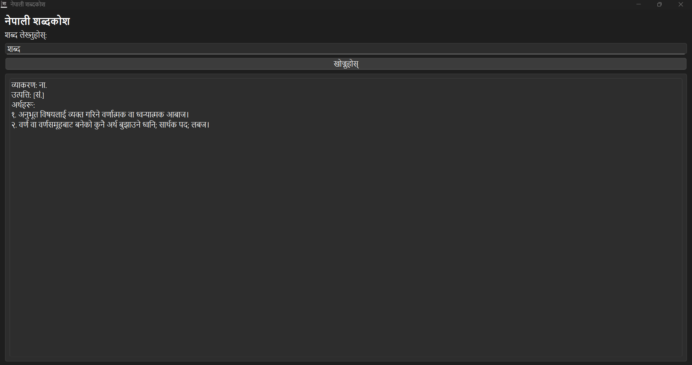

# शब्दकोश (Sabdakosh) - Nepali Dictionary

<p align="center">
  
  
  
  
  
</p>

<p align="center">
  <strong>A beautiful desktop Nepali Dictionary application built with PyQt6</strong>
</p>

<p align="center">
  <a href="#-features">Features</a> •
  <a href="#-download">Download</a> •
  <a href="#-screenshots">Screenshots</a> •
  <a href="#-installation">Installation</a> •
  <a href="#-usage">Usage</a>
</p>

---

## ✨ Features

- 🔍 **Fast Word Search** - Instantly search for Nepali words with real-time results
- 📖 **Comprehensive Definitions** - Get detailed meanings, grammar info, and etymology for each word
- 🎨 **Beautiful Native UI** - Clean and intuitive interface with native Nepali font (Nirmala UI) support
- 📚 **Rich Dictionary Database** - Extensive collection of Nepali words with multiple definitions
- ⌨️ **Keyboard Shortcuts** - Press Enter to search instantly
- 🔤 **Grammar Information** - View grammatical details (व्याकरण) for each word
- 📜 **Etymology Support** - Learn the origin (उत्पत्ति) of words
- 📝 **Multiple Meanings** - See all senses (अर्थहरू) of a word in one place
- ⚡ **Lightweight & Fast** - Quick startup and minimal resource usage
- 🖥️ **Windows Desktop App** - Native Windows application with easy installer

---

## 📥 Download

### Windows

Download the latest version from the **Releases** page:

<p align="center">
  <a href="https://github.com/adhikarisubodh9991/sabdakose/releases/latest">
    
  </a>
</p>

| Version | Platform | Download |
|---------|----------|----------|
| Latest | Windows (64-bit) | [**⬇️ Sabdakosh Installer**](https://github.com/adhikarisubodh9991/sabdakose/releases/latest) |

---

## 📸 Screenshots

<p align="center">
  
</p>

<p align="center">
  
</p>

---

## 🛠️ Installation (From Source)

If you want to run from source code:

### Prerequisites

- Python 3.8 or higher
- pip (Python package manager)

### Steps

1. **Clone the repository**
   ```bash
   git clone https://github.com/adhikarisubodh9991/sabdakose.git
   cd sabdakose
   ```

2. **Install dependencies**
   ```bash
   pip install -r requirements.txt
   ```

3. **Run the application**
   ```bash
   python sabdakose.py
   ```

---

## 📖 Usage

1. **Launch** the application
2. **Type** a Nepali word in the search box
3. **Press** Enter or click **"खोज्नुहोस्"** (Search)
4. **View** the word's definition, grammar, and etymology

### Keyboard Shortcuts

| Key | Action |
|-----|--------|
| `Enter` | Search for word |

---

## 🏗️ Building Executable

To create your own standalone executable:

```bash
pip install pyinstaller
pyinstaller --onefile --windowed --icon=assets/icon.ico --add-data "sabdakosh.json;." --add-data "assets;assets" sabdakose.py
```

---

## 📁 Project Structure

```
sabdakose/
├── sabdakose.py      # Main application code
├── sabdakosh.json    # Dictionary database
├── requirements.txt  # Python dependencies
├── assets/           # Application assets
│   ├── logo.png      # App logo
│   ├── icon.ico      # Windows icon
│   └── screenshots/  # Screenshots
│       ├── 1.png
│       └── 2.png
├── LICENSE           # MIT License
└── README.md         # This file
```

---

## 📄 License

This project is licensed under the MIT License - see the [LICENSE](LICENSE) file for details.

---

## 👨‍💻 Author

**Subodh Adhikari**

- GitHub: [@adhikarisubodh9991](https://github.com/adhikarisubodh9991)

---

<p align="center">
  Made with ❤️ for the Nepali language
</p>

<p align="center">
  ⭐ Star this repo if you find it useful!
</p>
